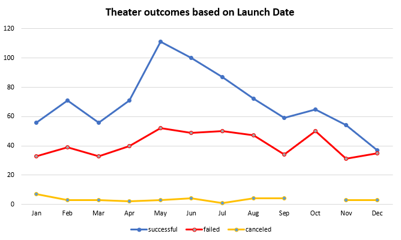

# Kicstarter Challenge Final Submission
## Overview of the project
**The purpose of the project was to learn excel, some basic statistics and key functions within excel to help a Crowdfunding Exercise**
The background for the project was to help Louise help launch a crowdfunding exercise by analysing data from past crowdfinding campaigns. Since she is seeking crowdfunding for a play we looked at plays as a sub-category and analysed the data to ensure that she makes an **informed, data-driven decision to launch her campaign**. Through the analysis we learned to create pivot tables and graphs which are one of the most widely used tools in any organisation.

## Analysis and Challenges
### Understanding the data
The first part of the analysis was to understand the data and one of the key things which I did here was to uncover the dates from the unicode format. This was the **first challenge** I had faced, as this date format gets used in multiple environments and coding languages and understanding what the numbers mean and uncovering the launch date and the deadline dates through the formula **_(((J2/60)/60)/24)+DATE(1970,1,1)_** was a great first step.

The second important thing I did was to colour-code the outcomes through conditional formatting. This allowed me to understand the status of every project visually and was a great help in validating future analysis at a glance. The next important aspect in understanding the data was to split the categories into parent and sub-category using the de-limiter. This furthered the understanding of data by bucketing them into relevant categories which was used in future analysis.

### Analysis:
1. **_Pivot Tables & Pivot Charts_**
  - Pivot tables were a great way to begin analysing the data which we had at hand. Clearly through the parent category and sub category pivot tables I was able to understand that plays in general have a higher tendency to be successful. However this was just the beginning and it gave me a peek into what is at stake.
2. **_Descriptive Statistics_**
  - Using descriptive statistics I was able to understand that the high fail rate is predominantly because campaigns having a higher goal than the successful campaigns in the U.S.  
 
 

### Analysis of Outcomes Based on Launch Date

1. For this analysis, the first taks was to use the ***YEAR()*** function to extract only the year from the campaign launch date field. As mentioned earlier, the campiagn launch date was converted from UNICODE to readable dates using the formula **_(((J2/60)/60)/24)+DATE(1970,1,1)_**.
2. The next step was to create a pivot table with all the values and add the newly created Year column and the parent category fields as filters
3. The Launch date was set as rows and the outcomes were set as columns, the count of outcomes were set as values in the value field settings
4. The Columns were then filtered to exclude "Live" campaigns for this analysis  

### Analysis of Outcomes Based on Goals

1. Here the first task was to create the goal buckets and the columns. This was a simple copy/paste and typing exercise to get the right columns and rows
2. The next step was to use Countifs() function to extract the relevant information to populate the table. 

